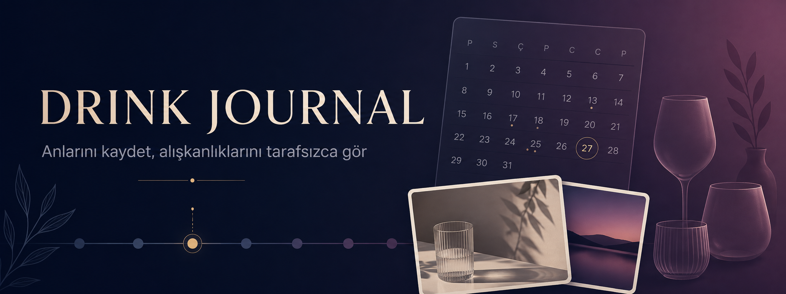

<h1 align="center">Drink Journal: Memories</h1>

  <strong>A personal iPhone diary for recording drinks, alcohol-free days and the memories around them.</strong>

  
  
  
  

## Product at a glance

| | |
| --- | --- |
| **Purpose** | Keep a personal record of drinks and the moments connected to them. |
| **Timeline** | A visual calendar brings entries and alcohol-free days into one view. |
| **Memories** | Optional notes, photos and share-ready portrait or landscape cards. |
| **Data approach** | Diary content stays on the user’s device. |

## The journal flow

1. **Record** — choose from a clear, localized drink list.
2. **Remember** — add an optional note or photo.
3. **Review** — browse the calendar and neutral summaries.
4. **Share** — create a portrait or landscape memory card.

## Highlights

- Localized drink catalogue and quick entry creation
- Visual calendar with alcohol-free day markers
- Optional notes and photo memories
- Neutral summaries for servings, volume and session duration
- Share-ready journal cards
- Multiple language support
- Optional one-time Lifetime Pro purchase

## Important

Drink Journal does **not** calculate blood alcohol concentration (BAC/promille), measure impairment, provide medical or legal advice, or determine whether someone is fit to drive.

## Türkçe

Drink Journal: Memories; içkileri, içki içilmeyen günleri ve bunlara eşlik eden anıları kişisel bir takvimde kaydetmeye odaklanır. Notlar, fotoğraflar ve tarafsız özetler sunar; promil hesabı ya da araç kullanma uygunluğu değerlendirmesi yapmaz.
